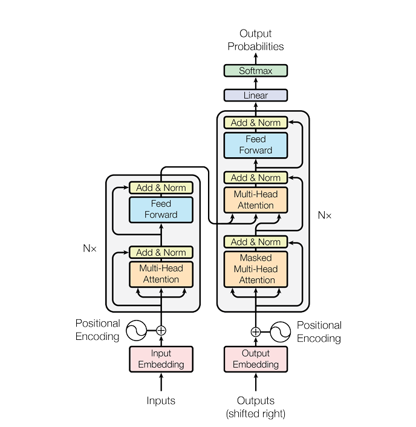
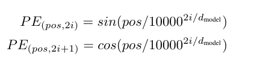

# Transformer模型论文复现
目标：完全手动复现论文《Attention is all you need》中提出的Transformer模型架构，使用开源数据集进行训练，得到loss图等数据，并且在Benchmark中取得可接受的分数，在服务器上部署，实现单用户实时翻译。

## 工具
### PyTorch
开源Python机器学习库，原论文中也是使用PyTorch实现，能够方便的实现高维矩阵计算，自动求导，计算loss函数，动态图像，神经网络构建等功能，可以大幅提高代码编写速度。同时原生支持GPU加速，可以提高模型训练效率。
### Jupyter Notebook
高效易用的Python机器学习工具，能够分步执行，显示图表图像。

## Transformer架构

## 核心组件
### 自注意力（self attention）
自注意力机制，在论文中被描述为Scaled Dot-Product Attention机制，它在继承原本注意力机制的Q,K,V矩阵的基础上，然Q,K,V矩阵都来自于数据自身，因此被称作自注意力机制。\
$w_q, w_k, w_v$参数矩阵是Transformer模型中核心需要训练的参数矩阵，在每次训练的过程中，$w_q, w_k, w_v$参数矩阵先与输入的数据做矩阵相乘，以此得到$Query, Key和Value$矩阵，这些矩阵均来自于数据自身
#### 计算
注意力的公式为$Attention(Q,K,V) = softmax(\frac{Q  K^T}{\sqrt d_k}) V$ \
在计算机中，除法是较为缓慢的，因此我们不妨将分母转换为$e^{-0.5 \times \ln d_k}$ \
最终的计算公式为：$Attention(Q,K,V) = softmax(e^{-0.5 \times \ln d_k} Q  K^T ) V$

### 前馈神经网络（FNN）
前馈神经网络在Transformer模型中起到重要作用，也是最简单实现的一部分，它的作用主要是提取文本语义。该神经网络的结构十分简单，是一个含有两个2048维隐藏层的全连接前馈神经网络，输入与输出则均为512维。

具体公式为：FFN(x) = max(0,xW1 +b1)W2 +b2

其中max为ReLU激活函数，具体公式为max(0, x) 是一个非常简单的激活函数

### 位置编码（Positional Encoding）
位置编码用于让Transform模型了解token在语句中的位置，不同于RNN的循环结构，Transform架构自身并不具备了解token位置信息的能力，因此需要对词嵌入后的结果进行特殊的位置编码来实现联系上下文的能力。

位置编码公式:  \
\
计算机计算除法的速度是比较慢的，因此利用数学中$a^b=e^{b\ln a}$可以将公式转化为\
$pos\times e^{-2i/d_{model}\times ln{10000}}$  

# 启动项目
## 配置虚拟环境
首先手动创建自己的虚拟环境
`python -m venv venv` \
**请务必将自己的虚拟环境名称设置为venv或者pytorch_venv，否则在git add时会导致严重问题**

## 下载依赖项
`pip install -r requirements.txt`

## 启动jupyter notebook
在虚拟环境中输入`jupyter notebook`即可启动项目